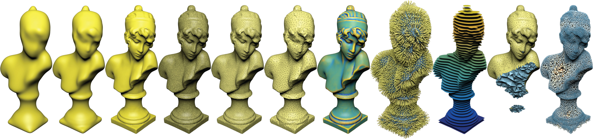

.. PyMesh documentation master file, created by
   sphinx-quickstart on Tue Apr 21 15:45:00 2015.
   You can adapt this file completely to your liking, but it should at least
   contain the root `toctree` directive.

=================================================
PyMesh --- Geometry Processing Library for Python
=================================================

PyMesh_ is a rapid prototyping platform focused on geometry processing.
It provides a set of common mesh processing functionalities and interfaces
with a number of state-of-the-art open source packages to combine their power
seamlessly under a single developing environment.

.. _PyMesh: https://github.com/PyMesh/PyMesh

Mesh process should be simple in python.  PyMesh promotes human readable,
minimalistic interface and works with native python data structures such as
`numpy.ndarray
<http://docs.scipy.org/doc/numpy/reference/generated/numpy.ndarray.html>`_.

Load mesh from file:

.. code:: python

    >>> import pymesh
    >>> mesh = pymesh.load_mesh("cube.obj");

Access mesh vertices:

.. code:: python

    >>> mesh.vertices
    array([[-1., -1.,  1.],
           ...
           [ 1.,  1.,  1.]])
    >>> type(mesh.vertices)
    <type 'numpy.ndarray'>

Compute Gaussian curvature for each vertex:

.. code:: python

    >>> mesh.add_attribute("vertex_gaussian_curvature");
    >>> mesh.get_attribute("vertex_gaussian_curvature");
    array([ 1.57079633,  1.57079633,  1.57079633,  1.57079633,  1.57079633,
            1.57079633,  1.57079633,  1.57079633])

Features:
=========

* Read/write 2D and 3D mesh in ``.obj``, ``.off``, ``.ply``, ``.stl``,
  ``.mesh`` (`MEDIT <http://www.ann.jussieu.fr/frey/publications/RT-0253.pdf>`_),
  ``.msh`` (`Gmsh <http://geuz.org/gmsh/doc/texinfo/gmsh.html#File-formats>`_)
  and ``.node/.face/.ele``
  (`Tetgen <http://wias-berlin.de/software/tetgen/1.5/doc/manual/manual006.html>`_)
  formats.
* Support load and save per vertex/face/voxel scalar and vector fields.
* Local mesh processing such edge collapse/split, duplicated vertex/face removal
  etc.
* Mesh boolean support from CGAL, Cork, Carve, Clipper (2D only) and libigl.
* Mesh generation support from CGAL, Triangle, TetGen and Quartet.
* Wire network and inflation of wire networks.
* Finite element matrix assembly. (supports Laplacian, stiffness, mass, etc.)

Contents:
=========

.. toctree::
   :maxdepth: 3

   user_guide
   api

Indices and tables
==================

* :ref:`genindex`
* :ref:`modindex`
* :ref:`search`

