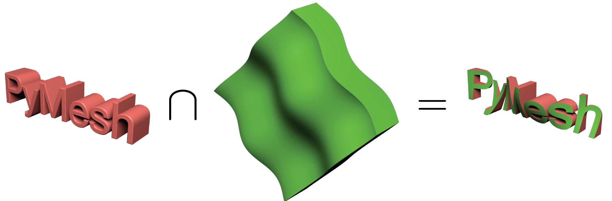
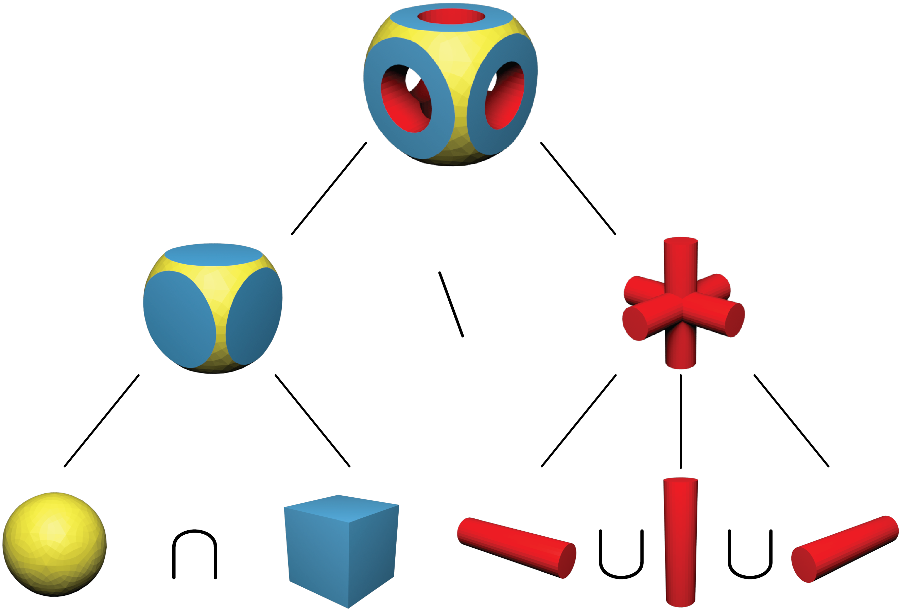

Mesh Boolean
============

Boolean operation is one of the fundamental operations for 3D modeling.  It
combines two or more solid shapes (say :math:`A` and :math:`B`)
by checking if a point :math:`x` lies inside of each solid.  Four commonly used
binary boolean operations are:

* Union: :math:`A \cup B := \{ x \in \mathbb{R}^3 \mid x \in A \textrm{ and } x \in B \}`

* Intersection: :math:`A \cap B := \{ x \in \mathbb{R}^3 \mid x \in A \textrm{ or } x \in B \}`

* Difference: :math:`A \setminus B := \{ x \in \mathbb{R}^3 \mid x \in A \textrm{ and } x \notin B \}`

* Symmetric difference: :math:`A \textrm{ XOR }  B := (A \setminus B) \cup (B \setminus A)`

The following figure illustrates the output of boolean operations on a sphere
and a cube:

.. image:: _static/boolean.png
    :width: 90%
    :align: center

Boolean Interface
-----------------

PyMesh provides support for all four operations through third party boolean
*engines*.  For example, computing the union of ``mesh_A`` and ``mesh_B`` can be
achieved with the following snippet::

    >>> mesh_A = pymesh.load_mesh("A.obj")
    >>> mesh_B = pymesh.load_mesh("B.obj")
    >>> output_mesh = pymesh.boolean(mesh_A, mesh_B,
    ...                              operation="union",
    ...                              engine="igl")

The interface is very minimal and self-explanatory.
The available operations are ``"union"``, ``"intersection"``, ``"difference"``
and ``"symmetric_difference"``.  PyMesh supports the following boolean engines:

* ``"igl"``: Boolean module from libigl, which is also the default engine for 3D
  inputs.
* ``"cgal"``: Naf polyhedron implementation from CGAL.
* ``"cork"``: Cork boolean library.
* ``"carve"``: Carve boolean library.
* ``"corefinement"``: The unpublished boolean engine also from CGAL.
* ``"clipper"``: 2D boolean engine for polygons, the default engine for 2D
  inputs.

The following attributes are defined in the ``output_mesh``:

* ``source``: A per-face scalar attribute indicating which input mesh an output
  face belongs to.
* ``source_face``: A per-face scalar attribute representing the combined input
  face index of an output face, where combined input faces are simply the
  concatenation of faces from ``mesh_A`` and ``mesh_B``.

A Simple Example
----------------

As a simple example, we are going to operate on the following objects:

* Mesh A (`pymesh.ply <_static/pymesh.ply>`_) contains the extruded text ``PyMesh``.

* Mesh B (`plate.ply <_static/plate.ply>`_) contains an extruded wavy plate.

To compute their intersection::

    >>> A = pymesh.load_mesh("pymesh.ply")
    >>> B = pymesh.load_mesh("plate.ply")
    >>> intersection = pymesh.boolean(A, B, "intersection")

    >>> # Checking the source attribute
    >>> intersection.attribute_names
    ('source', 'source_face')
    >>> intersection.get_attribute("source")
    array([ 1.,  1.,  0., ...,  1.,  1.,  1.])

The operation is illustrated in the following figure:

The attribute ``source`` tracks the *source* of each output face.  0 means the
output face comes from the first operand, i.e. ``pymesh.ply``, and 1 means it is from
the second operand, i.e. ``plate.ply``.
The ``source`` attribute is useful for assigning the corresponding colors
in the output mesh.

CSG Tree
--------

While binary boolean operations are useful, it is often necessary to perform a
number of operations in order to create more complex results.  A
Constructive Solid Geometry tree, aka.CSG tree, is designed for this purpose.

As illustrated in the figure above, CSG tree provides a structured way of
building complex shapes from simple ones.  Each node in the tree represents a 3D
shape.  Leaf nodes represent user input shapes.
A non-leaf node consists of a boolean operation and a number of child nodes.
The shape it represents can be obtained by performing the specified boolean
operation on shapes from its children.  In particular, ``union`` and
``intersection`` node can have any number of children (i.e. N-ary union and N-ary
intersection), but ``difference`` and ``symmetric_difference`` nodes must have
exactly two children.

PyMesh represents CSG tree using ``pymesh.CSGTree`` class.
Given the `input meshes <_static/csg_input.zip>`_,
one can construct and evaluate a CST tree using the following code::

    >>> ball = pymesh.load_mesh("ball.stl")
    >>> box = pymesh.load_mesh("box.stl")
    >>> x = pymesh.load_mesh("x.stl")
    >>> y = pymesh.load_mesh("y.stl")
    >>> z = pymesh.load_mesh("z.stl")

    >>> csg = pymesh.CSGTree({
            "difference": [
                { "intersection": [{"mesh": box}, {"mesh": ball}] },
                { "union": [{"mesh": x}, {"mesh": y}, {"mesh": z}]}
            ]
        })

    >>> output = csg.mesh

Notice that the constructor of ``CSGTree`` takes a python dictionary as argument.
The entire tree structure is captured in the dictionary.  The context free
grammar for this dictionary is::

    Node -> {Operation : Children}
    Node -> {"mesh": Mesh}
    Node -> CSGTree
    Children -> [Node, Node, ...]
    Operation -> "union" | "intersection" | "difference" | "symmetric_difference"

where ``Mesh`` is a ``pymesh.Mesh`` object and ``CSGTree`` is a
``pymesh.CSGTree`` object.  One can construct the entire tree all together
as shown above or build up the tree incrementally::

    >>> left_tree = pymesh.CSGTree({
            "intersection": [{"mesh": box}, {"mesh": ball}]
        })
    >>> right_tree = pymesh.CSGTree({
            "union": [{"mesh": x}, {"mesh": y}, {"mesh": z}]
        })
    >>> csg = pymesh.CSGTree({
            "difference": [left_tree, right_tree]
        })

    >>> left_mesh = left_tree.mesh
    >>> right_mesh = right_tree.mesh
    >>> output = csg.mesh

