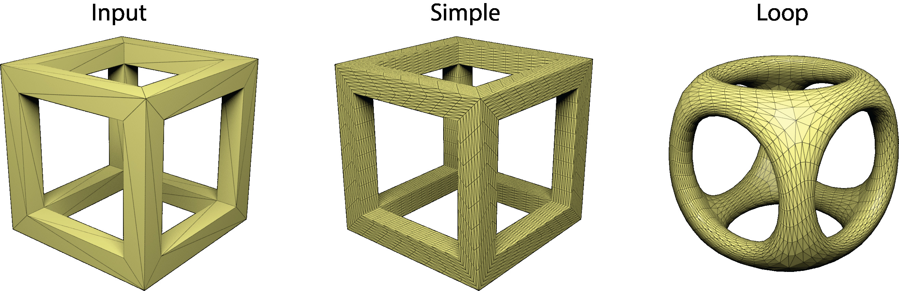

Mesh Processing
===============

It is often necessary to change the mesh.  PyMesh has built-in capabilities
of commonly used operations.

Collapse Short Edges
--------------------

To collapse all edges shorter than or equal to ``tol``::

    >>> mesh, info = pymesh.collapse_short_edges(mesh, tol)

The function returns two things: a new mesh with all short edges removed, and
some extra information::

    >>> info.keys()
    ['num_edge_collapsed']

    >>> info["num_edge_collapse"]
    124

    >>> mesh.attribute_names
    ['face_sources']

    >>> mesh.get_attribute("face_sources")
    array([    0,     1,     2, ..., 20109, 20110, 20111])

The ``face_sources`` attribute maps each output face to the index of the source face
from the input mesh.

One can even perform this function on a raw mesh::

    >>> vertices, faces, info = pymesh.collapse_short_edges_raw(
    ...     vertices, faces, tol)

In addition to setting an absolute threshold, one can use a relative threshold
based on the average edge length::

    >>> mesh, __ = pymesh.collapse_short_edges(mesh, rel_threshold=0.1)

In the above example, all edges shorter than or equal to 10% of the average edge
length are collapsed.

It is well known that sharp features could be lost due to edge collapse.  To
avoid destroying sharp features, turn on the ``preserve_feature`` flag::

    >>> mesh, __ = pymesh.collapse_short_edges(mesh, tol,
    ...     preserve_feature=True)

One of the main applications of this method is to simplify overly triangulated
meshes.  As shown in the following figure, the input mesh (top) is of very high
resolution near curvy regions.  With ``pymesh.collapse_short_edges``, we can
create a coarse mesh (bottom) to approximate the input shape.  The quality of the
approximation depends heavily on the value of ``tol``.

.. image:: _static/edge_collapse.png
    :width: 90%
    :align: center

Split Long Edges
----------------

Another very useful but rarely implemented mesh processing operation is to
split long edges.  To split all edges longer than ``tol``::

    >>> mesh, info = pymesh.split_long_edges(mesh, tol)

The return values consist of the new mesh and a dummy information field for
future usage::

    >>> info.keys()
    {}

The returned mesh contains all the vertices from input mesh and newly inserted
vertices.  Certain faces may be split.  Unlike standard subdivision algorithm,
the algorithm only split faces that contain long edges and leaves the rest
alone.

It is also possible to operate on a raw mesh::

    >>> vertices, faces, info = pymesh.split_long_edges(mesh, tol)

This method is often used to eliminate long edges appearing in sliver
triangles.  The following figure shows its effect.

.. image:: _static/split_long_edges.png
    :width: 90%
    :align: center

Remeshing
---------

It is possible to completely remesh the input shape by calling
``pymesh.collapse_short_edges`` and ``pymesh.split_long_edges`` iteratively in
an alternating fashion.  The script
`fix_mesh.py <https://github.com/PyMesh/PyMesh/blob/master/scripts/fix_mesh.py>`_ is based on this idea.
Its effects can be seen in a remesh of the `Ducky The Lop Eared Bunny
<http://www.thingiverse.com/thing:752379>`_ example:

.. image:: _static/ducky_bunny.jpg
    :width: 90%
    :align: center

Remove Isolated Vertices
------------------------

To remove vertices that is not part of any face or voxel::

    >>> mesh, info = pymesh.remove_isolated_vertices(mesh)

In addition to the output mesh, a information dictionary is returned::

    >>> info.keys()
    ['ori_vertex_index', 'num_vertex_removed']

    >>> info["ori_vertex_index"]
    array([     0,      1,      2, ..., 167015, 167016, 167017])

    >>> info["num_vertex_removed"]
    12

As usual, there is a version that operates directly on the raw mesh::

    >>> vertices, face, __ = pymesh.remove_isolated_vertices_raw(
    ...     vertices, faces)

Remove Duplicated Vertices
--------------------------

Sometimes, one may need to merge vertices that are coinciding or close-by
measured in Euclidean distance.  For example, one may need to zip the triangles
together from a triangle soup.  To achieve it::

    >>> mesh, info = pymesh.remove_duplicated_vertices(mesh, tol)

The argument ``tol`` defines the tolerance within which vertices are considered
as duplicates.  In addition to the output mesh, some information is also
returned::

    >>> info.keys()
    ['num_vertex_merged', 'index_map']

    >>> info["num_vertex_merged"]
    5

    >>> info["index_map"]
    array([     0,      1,      2, ..., 153568, 153569, 153570])

By default, all duplicated vertices are replaced by the vertex with the smallest
index.  It is sometimes useful to specify some vertices to be more important
than other and their coordinates should be used as the merged vertices in the
output.  To achieve this::

    >>> weights = mesh.vertices[:, 0];
    >>> mesh, info = pymesh.remove_duplicated_vertices(mesh, tol,
    ...     importance=weights)

In the above example, we use the X coordinates as the importance weight.  When
close by vertices are merged, the coordinates of the vertex with the highest X
values are used.

As usual, one can operate directly on raw meshes::

    >>> vertices, faces, info = pymesh.remove_duplicated_vertices_raw(
    ...     vertices, faces, tol)

Remove Duplicated Faces
-----------------------

It is also useful to remove duplicated faces::

    >>> mesh, info = pymesh.remove_duplicated_faces(mesh)

The resulting mesh and some information is returned::

    >>> info.keys()
    ['ori_face_index']

    >>> info["ori_face_index"]
    array([    0,     1,     2, ..., 54891, 54892, 54893])

The field ``ori_face_index`` provides the source vertex index for each output
vertex.

To operate on raw meshes::

    >>> vertices, faces, info = pymesh.remove_duplicated_faces(
    ...     vertices, faces)

Subdividing Mesh
----------------

PyMesh supports both simple and loop subdivision of a given triangular mesh::

    >>> mesh = pymesh.subdivide(mesh, order=2, method="loop")
    >>> mesh.get_attribute("ori_face_index")
    array([ 0.,  0.,  0., ..., 95., 95., 95.])

Here are some examples of different subdivision methods:

