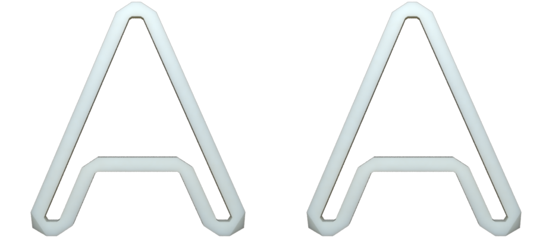
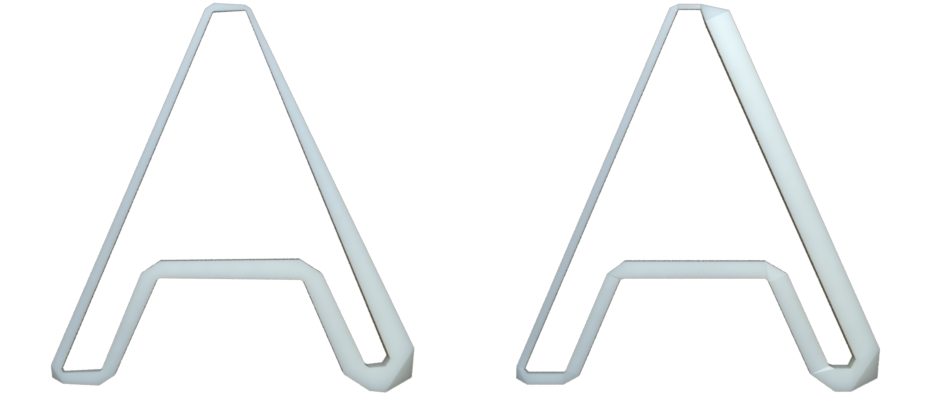
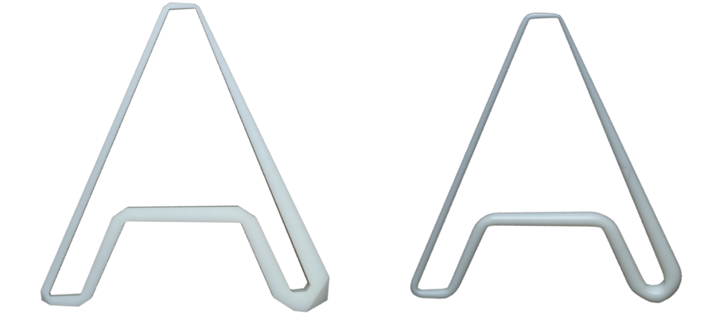
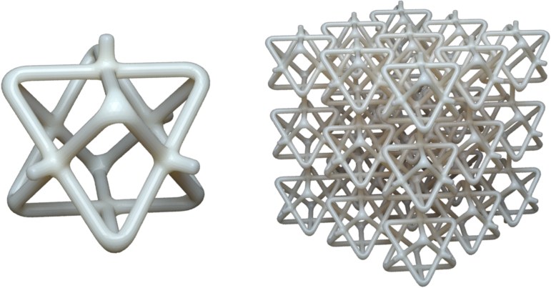

Wire Inflation
==============

Overview
--------

The goal of ``wires`` package is to provide an easy way of modeling frame
structures. A frame structure can be uniquely define by 3 parts:

* Vertex positions
* Topology/Connectivity
* Edge/vertex thickness

Given these 3 parts as input, we implement `a very efficient algorithm proposed
by George Hart <http://georgehart.com/echinoderms/hart.pdf>`_   to generate the
output triangular mesh.

The ``wires`` involves just 3 main classes: `WireNetwork`, `Inflator` and
`Tiler`.  Understanding these 3 classes would allow one to generate wide variety
of frame structures. In a nutshell, vertex positions and topology are encoded in
the `WireNetwork` data structure.  The `Inflator` class takes a `WireNetwork`
object and its corresponding thickness assignment as input, and it outputs an
triangular mesh. The `Tiler` class takes a `WireNetwork` object as a unit
pattern and tile it according to certain rules, and its output is the tiled
`WireNetwork` object.

WireNetwork
-----------

``WireNetwork`` class represents the vertex positions and topology of a frame
structure.  It can be easily modeled by hand or using tools such as
`blender <https://www.blender.org/>`_.

Construction from data:
^^^^^^^^^^^^^^^^^^^^^^^

To create a `WireNetwork` object, we just need to provide a set of vertices and
a set of edges::

    >>> vertices = np.array([
    ...     [0, 0, 0],
    ...     [1, 0, 0],
    ...     [0, 1, 0],
    ...     [1, 1, 0]
    ...     ])
    >>> edges = np.array([
    ...     [0, 1],
    ...     [1, 3],
    ...     [2, 3],
    ...     [2, 0]
    ...     ]);
    >>> wire_network = pymesh.wires.WireNetwork.create_from_data(
    ...     vertices, edges)

Notice that ``edges`` is a list of vertex index pairs, and vertex index starts
from 0.

Construction from file:
^^^^^^^^^^^^^^^^^^^^^^^

Alternatively, one can use ``.obj`` format to encode a wire networks::

    # Filename: test.wire
    v 0.0 0.0 0.0
    v 1.0 0.0 0.0
    v 0.0 1.0 0.0
    v 1.0 1.0 0.0
    l 1 2
    l 2 4
    l 3 4
    l 3 1

Lines starting with ``v`` are specifies vertex coordinates, and lines starting
with ``l`` are edges.  Notice that indices starts from 1 in ``.obj`` files. One
advantage of using the ``.obj`` format to store wire network is that it can be
opened directly by Blender.  However, to distinguish with triangular mesh, I
normally change the suffix to ``.wire``.

To create a wire network from file::

    >>> wire_network = pymesh.wires.WireNetwork.create_from_file(
    ...     "test.wire")

Empty wire network and update data:
^^^^^^^^^^^^^^^^^^^^^^^^^^^^^^^^^^^

Sometimes it is useful to create an empty wire network (0 vertices, 0 edges)::

    >>> empty_wires = pymesh.wires.WireNetwork.create_empty()

Once created, the vertices and edges of a `WireNetwork` are generally read-only
because updating the geometry typically invalidates vertex and edge attributes
such as edge lengths.  However, it is possible to assign an entirely new set of
vertices and edges to a `WireNetwork` object using the ``load`` and
``load_from_file`` method::

    >>> wire_network.load(vertices, edges)

    >>> wire_network.load_from_file("test.wire")

Save to file:
^^^^^^^^^^^^^

To save a wire network to file::

    >>> wire_network.write_to_file("debug.wire")

Accessing vertices and edges:
^^^^^^^^^^^^^^^^^^^^^^^^^^^^^

Once a ``WireNetwork`` object is created, one can access the vertices and edges
directly::

    >>> wire_network.dim
    3
    >>> wire_network.num_vertices
    4
    >>> wire_network.vertices
    array([[ 0.,  0.,  0.],
           [ 1.,  0.,  0.],
           [ 0.,  1.,  0.],
           [ 1.,  1.,  0.]])

    >>> wire_network.num_edges
    4
    >>> wire_network.edges
    array([[0, 1],
           [1, 3],
           [2, 3],
           [2, 0]])

Vertex adjacency:
^^^^^^^^^^^^^^^^^

One can easily access vertex adjacency information by ``get_vertex_neighbors``
method::

    >>> wire_network.get_vertex_neighbors(vertex_index)
    array([1, 9])

This method can also be used for computing vertex valance (i.e. the number of
neighboring vertices).

Attributes:
^^^^^^^^^^^

Just like the `Mesh` class, it is possible to define attribute to represent
scalar and vector fields associated with each vertex and edge.  For example::

    >>> vertex_colors = np.zeros((wire_network.num_vertices, 3));
    >>> wire_network.add_attribute("vertex_color", vertex_colors)
    >>> print(wire_network.get_attribute("vertex_color"));
    array([[ 0.,  0.,  0.],
           [ 0.,  0.,  0.],
           [ 0.,  0.,  0.],
           [ 0.,  0.,  0.]])

All attribute names can be retrieved using the ``attribute_names`` attribute::

    >>> wire_network.attribute_name
    ("vertex_color")

Symmetry orbits:
^^^^^^^^^^^^^^^^

It is sometimes important to compute the `symmetry orbits
<https://en.wikipedia.org/wiki/Group_action>`_ of the wire network::

    >>> wire_network.compute_symmetry_orbits()

This command adds 4 attributes to the wire network:

* ``vertex_symmetry_orbit``: Per-vertex scalar field specifying the orbit each
  vertex belongs to . Vertices from the same orbit can be mapped to each other by
  reflection with respect to axis-aligned planes.

* ``vertex_cubic_symmetry_orbit``: Per-vertex scalar field specifying the cubic
  orbit each vertex belongs to.  Vertices from the same cubic orbit can be
  mapped to each other by all reflection symmetry planes of a unit cube.

* ``edge_symmetry_orbit``: Per-edge scalar field specifying the orbit each edge
  belongs to.  Edges from the same orbit can be mapped to each other by
  reflection with respect to axis-aligned planes.

* ``edge_cubic_symmetry_orbit``: Per-edge scalar field specifying the cubic
  orbit each edge belongs to.  Edges from the same cubic orbit can be mapped to
  each other by reflection with respect to reflection symmetry planes of a unit
  cube.

These attributes can be access via ``get_attribute()`` method::

    >>> wire_network.get_attribute("vertex_symmetry_orbit")
    array([ 0.,  0.,  0.,  0., 1., 1., 1., 1.])

In the example above, vertex 0 to 3 belongs to orbit 0, and vertex 4 to 7
belongs to orbit 1.

Miscellaneous functions:
^^^^^^^^^^^^^^^^^^^^^^^^

The ``WireNetwork`` class also have a list of handy built-in functionalities.

To access axis-aligned bounding box::

    >>> bbox_min, bbox_max = wire_network.bbox
    >>> bbox_min
    array([ 0.   ,  0.   , 0.])
    >>> bbox_max
    array([ 1.   ,  1.   , 0.])
    >>> wire_network.bbox_center
    array([0.5, 0.5, 0.0])

To access the centroid of the wire network (average of the vertex locations)::

    >>> wire_network.centroid
    array([0.5, 0.5, 0.0])

To access the edge lengths::

    >>> wire_network.edge_lengths
    array([1.0, 1.0, 1.0, 1.0])
    >>> wire_network.total_wire_length
    4.0

To recursively trim all dangling edges (edges with at least one valance 1 end
points)::

    >>> wire_network.trim()

To offset each vertex::

    >>> offset_vectors = np.random.rand(
    ...     wire_network.num_vertices, wire_network.dim)
    >>> wire_network.offset(offset_vectors);

To center the wire network at the origin (such that its bounding box center is
the origin)::

    >>> wire_network.center_at_origin()

Wire Inflation
--------------

Uniform thickness:
^^^^^^^^^^^^^^^^^^

Wire inflation refers to the process of converting a `WireNetwork` plus some
thickness assignment to a triangular mesh.  The inflation logic is encapsulated
in the `Inflator` class::

    >>> inflator = pymesh.wires.Inflator(wire_network)

Thickness is just a scalar field.  It can be assigned to each vertex or to
each edge.  Here are some example to assign uniform thickness to vertices and
edges::

    >>> # Assign each vertex with thickness 0.5mm
    >>> inflator.inflate(0.5, per_vertex_thickness=True)
    >>> mesh = inflator.mesh

    >>> # Assign each edge with thickness 0.5mm
    >>> inflator.inflate(0.5, per_vertex_thickness=False)
    >>> mesh = inflator.mesh

The output mesh look the same due to uniform thickness.

.. |uniform_vertex_thickness| image:: _static/uniform_vertex_thickness.png
    :scale: 50%
.. |uniform_edge_thickness| image:: _static/uniform_edge_thickness.png
    :scale: 50%

    Inflation output for uniform vertex thickness (left) and uniform edge
    thickness (right).

Because per-vertex and per-edge uniform thickness assignments produce the same
output, one does not need to explicitly specify the ``per_vertex_thickness``
flag::

    >>> inflator.inflate(0.5)
    >>> mesh = inflator.mesh

Variable thickness:
^^^^^^^^^^^^^^^^^^^

It is also possible to assign a thickness value per-vertex or per-edge::

    >>> # Assign each vertex with thickness 0.1 to 0.6
    >>> thickness = np.arange(wire_network.num_vertices) / \
    ...     wire_network.num_vertices * 0.5 + 0.1
    >>> inflator.inflate(thickness, per_vertex_thickness=True)
    >>> mesh = inflator.mesh

    >>> # Assign each edge with thickness 0.1 to 0.6
    >>> thickness = np.arange(wire_network.num_edges) / \
    ...     wire_network.num_edges * 0.5 + 0.1
    >>> inflator.inflate(thickness, per_vertex_thickness=False)
    >>> mesh = inflator.mesh

and the output meshes looks like the following:

.. |var_vertex_thickness| image:: _static/var_vertex_thickness.png
    :scale: 50%
.. |var_edge_thickness| image:: _static/var_edge_thickness.png
    :scale: 50%

    Inflation output for per-vertex (left) and per-edge (right) thickness.

Refinement:
^^^^^^^^^^^

As one may notice from the figure above, the inflated mesh could contain sharp
corners.  This may be undesirable sometimes.  Fortunately, `Inflator` class has
refinement built-in::

    >>> thickness = np.arange(wire_network.num_vertices) / \
    ...     wire_network.num_vertices * 0.5 + 0.1
    >>> inflator.set_refinement(2, "loop")
    >>> inflator.inflate(thickness, per_vertex_thickness=True)
    >>> mesh = inflator.mesh

The above example refines the output mesh by applying ``loop`` subdivision
twice.  This create a smooth inflated mesh:

.. |subdiv_vertex_thickness| image:: _static/var_vertex_thickness_refined.png
    :scale: 50%

    Inflation output without (left) and with (right) ``loop`` refinement.

Another refinement method is the ``simple`` refinement.  The ``simple``
refinement does not smooth the geometry but adds more triangles.

Wire profile:
^^^^^^^^^^^^^

By default, each wire is inflated to a rectangular pipe with square cross
sections.  It is possible to use any regular N-gon as the cross section by
setting the wire profile::

    >>> # Hexagon
    >>> inflator.set_profile(6)
    >>> mesh = inflator.mesh

    >>> # Triangle
    >>> inflator.set_profile(3)
    >>> mesh = inflator.mesh

.. |triangle_cross_section| image:: _static/triangle_cross_section.png
    :align: middle
    :scale: 50%
.. |hexagon_cross_section| image:: _static/hexagon_cross_section.png
    :align: middle
    :scale: 50%

.. figure:: _static/triangle_and_hexagon_profile.png
    :scale: 50%
    :align: center

    Inflation with triangle profile (left) and hexagon profile (right).

Tiling
------

The `Inflator` class is capable of inflating arbitrary wire networks.  One
particular important use case is to inflate a tiled network.  The `Tiler` class
takes a single `WireNetwork` object as input and generate a tiled wire network
that can be later inflated.  There are several ways to perform tiling.

Regular tiling:
^^^^^^^^^^^^^^^

Regular tiling refers to tiling according to a regular grid.  To tile a cube of
size 15 with a 3x3x3 tiling of a given wire network (e.g. similar to putting a
wire network in each cell of a Rubik's cube)::

    >>> tiler = Tiler(wire_network)
    >>> box_min = np.zeros(3)
    >>> box_max = np.ones(3) * 15.0
    >>> reps = [3, 3, 3]
    >>> tiler.tile_with_guide_bbox(box_min, box_max, reps)
    >>> tiled_wires = tiler.wire_network

The output ``tiled_wires`` (inflated with thickness 0.5 and refined twice) looks like the
following:

    A single cell wire network (left) and the corresponding 3x3x3 tiling
    (right).

Mesh guided tiling:
^^^^^^^^^^^^^^^^^^^

It is also possible to tile according to any hexahedron mesh.  For example,
provided an L-shaped hex mesh::

    >>> guide_mesh = pymesh.load_Mesh("L_hex.msh")
    >>> tiler = Tiler(wire_network)
    >>> tiler.tile_with_guide_mesh(guide_mesh)
    >>> tiled_wires = tiler.wire_network

The output (inflated with thickness 0.5 and refined twice) looks like:

.. figure:: _static/guide_mesh_tiling.png
    :scale: 50%
    :align: center

    Guide hex mesh (left) and the tiled result (right).

In fact, the guide hex mesh does not need to be axis-aligned.  The single cell
wire network would be warped to fit inside each hex using tri/bi-linear
interpolation.  An example is coming soon.

